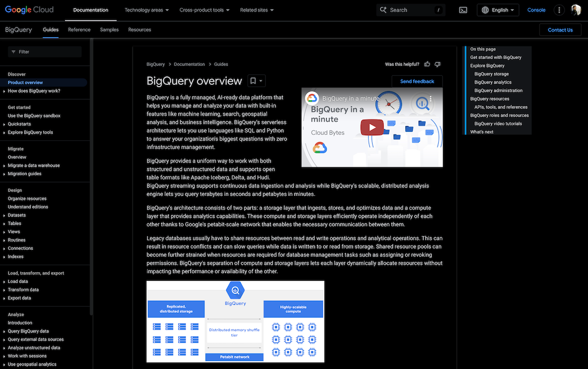

# dark-plz

Chrome Extension for forcing dark theme to any web by apply css filter invert.

## Setup

1. Enable chrome extension developer mode.
1. Clone this repo.
1. Load unpacked to cloned folder.
1. Pin and refresh the web once.
1. Click to toggle the dark theme.
1. Happy!

## Features

- Just invert everything.
- But not invert video, img, svg.
- Trigger hidden dark theme if has.

## Support

- Google Developers: https://developers.google.com/
- PDF viewer e.g.: https://arxiv.org/pdf/2408.02442
- Hidden theme e.g.: https://chat.deepseek.com/
- AppScript: https://script.google.com/

## Coffee

If you like this please [buy me a coffee ☕️ ](https://github.com/sponsors/gist-rs)
